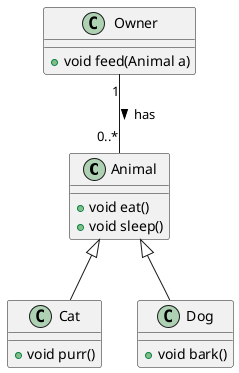

# PlantUML Installation and Usage Guide

## Introduction

[PlantUML](http://plantuml.com/) is a versatile open-source tool that allows developers to draw diagrams using a simple and intuitive language. It can be used to create various kinds of diagrams such as class diagrams, sequence diagrams, component diagrams, and more. We at [Your Organization's Name] utilize PlantUML to create comprehensive class diagrams and facilitate communication within our team.

This guide provides step-by-step instructions on how to install and use PlantUML within Visual Studio Code (VSCode) for macOS users.

## Installation

Before using PlantUML in VSCode, it is necessary to have some dependencies installed on your system. Follow these instructions to install the necessary dependencies:

1. Open Terminal

2. Install `libtool` by running:

```shell
brew install libtool
brew link libtool
```

3. Install `graphviz` by running:

```shell
brew install graphviz
brew link --overwrite graphviz
```

After installing these dependencies, you can proceed to install the PlantUML extension in VSCode.

## PlantUML Extension in VSCode

1. Open VSCode.

2. Go to the Extensions view (You can press `Cmd` + `Shift` + `X` to open the Extensions view).

3. In the search box, type "PlantUML" and press `Enter`.

4. Click on the first result in the list (It should be "PlantUML" by "jebbs").

5. Click on the Install button to install the extension.

Once the extension is installed, you can start creating your UML diagrams.

## Creating a UML Diagram

1. Open a new file (`File` > `New File` or `Cmd` + `N`).

2. Save the file with a `.puml` extension (e.g., `diagram.puml`).

3. Start writing your UML diagram in PlantUML language. Here's a simple class diagram example:



In this diagram (plantUML): 

- `Animal` is a superclass that has two methods `eat()` and `sleep()`.
- `Cat` and `Dog` are subclasses of `Animal`. They inherit the methods from `Animal` and also have their own methods (`purr()` for `Cat` and `bark()` for `Dog`).
- `Owner` is a separate class that has a method `feed(Animal a)` which can feed any Animal.
- `Owner` and `Animal` have an association relationship which is represented by a line connecting them. The `"1"` on the Owner side and `"0..*"` on the Animal side represent multiplicity (an Owner can have zero to many Animals).

4. To preview your UML diagram, you can either:

   - Use the Command Palette (`Cmd` + `Shift` + `P`), type "PlantUML: Preview Current Diagram" and press `Enter`.
   
   - Or, use the shortcut `Ctrl`/`Cmd` + `D` to display the diagram directly.
  
<p align="center">

</p>

Remember, you might need to increase the default timeout in the extension settings if you are working with larger class diagrams. You can do this by opening the Command Palette (`Cmd` + `Shift` + `P`), type "Preferences: Open User Settings", press `Enter

` and search for "PlantUML server timeout". The default is 3 seconds, but you may want to increase it based on your needs.

We hope this guide helps you get started with PlantUML in VSCode. Happy diagramming!
