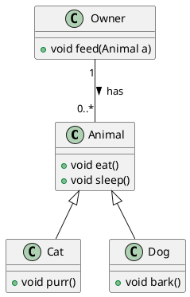

# PlantUML Installation and Usage Guide

## Introduction

[PlantUML](http://plantuml.com/) is a versatile open-source tool that allows developers to draw diagrams using a simple and intuitive language. It can be used to create various kinds of diagrams such as class diagrams, sequence diagrams, component diagrams, and more. We at [Your Organization's Name] utilize PlantUML to create comprehensive class diagrams and facilitate communication within our team.

This guide provides step-by-step instructions on how to install and use PlantUML within Visual Studio Code (VSCode) for macOS users.

## Installation

Before using PlantUML in VSCode, it is necessary to have some dependencies installed on your system. Follow these instructions to install the necessary dependencies:

1. Open Terminal

2. Install `libtool` by running:

```shell
brew install libtool
brew link libtool
```

3. Install `graphviz` by running:

```shell
brew install graphviz
brew link --overwrite graphviz
```

After installing these dependencies, you can proceed to install the PlantUML extension in VSCode.

## PlantUML Extension in VSCode

1. Open VSCode.

2. Go to the Extensions view (You can press `Cmd` + `Shift` + `X` to open the Extensions view).

3. In the search box, type "PlantUML" and press `Enter`.

4. Click on the first result in the list (It should be "PlantUML" by "jebbs").

5. Click on the Install button to install the extension.

Once the extension is installed, you can start creating your UML diagrams.

## Creating a UML Diagram

1. Open a new file (`File` > `New File` or `Cmd` + `N`).

2. Save the file with a `.puml` extension (e.g., `diagram.puml`).

3. Start writing your UML diagram in PlantUML language. Here's a simple class diagram example:



In this diagram (plantUML): 

- `Animal` is a superclass that has two methods `eat()` and `sleep()`.
- `Cat` and `Dog` are subclasses of `Animal`. They inherit the methods from `Animal` and also have their own methods (`purr()` for `Cat` and `bark()` for `Dog`).
- `Owner` is a separate class that has a method `feed(Animal a)` which can feed any Animal.
- `Owner` and `Animal` have an association relationship which is represented by a line connecting them. The `"1"` on the Owner side and `"0..*"` on the Animal side represent multiplicity (an Owner can have zero to many Animals).

4. To preview your UML diagram, you can either:

   - Use the Command Palette (`Cmd` + `Shift` + `P`), type "PlantUML: Preview Current Diagram" and press `Enter`.
   
   - Or, use the shortcut `Ctrl`/`Cmd` + `D` to display the diagram directly.
  
<p align="center">

</p>

Remember, you might need to increase the default timeout in the extension settings if you are working with larger class diagrams. 
You can do this by opening the Command Palette (`Cmd` + `Shift` + `P`), type "Preferences: Open User Settings", press `Enter` and search for "PlantUML server timeout". The default is 3 seconds, but you may want to increase it based on your needs.

We hope this guide helps you get started with PlantUML in VSCode. Happy diagramming!

# C++ and Pybind11 - Call Python Functions via C++ 
## Introduction
This repository contains starter code in C++ to utilize [Pybind11](https://pybind11.readthedocs.io/en/stable/), a library allowing developers to call Python functions and objects, as well as load the Python interpreter all from C++. Pybind11 is built on the [Python/C API](https://docs.python.org/3/c-api/index.html), the official documentation to expose Python and C libraries to each other.

## Project Structure
In **main.cpp**, one will find starter code to run a Python function to print a simple "Hello World!" into the console. In **numpy.cpp**, one will find starter code to run a Python function importing the Numpy library and loading a Numpy array as a Python object. 

## Prerequisites

- Make sure Python and its headers are properly installed.
- Ensure the `numpy` Python library is installed. You can install it using pip: `pip install numpy`.
- Your project directory should contain the `pybind11` library in a subdirectory. If not, clone it from the Pybind11 GitHub repository: `git clone https://github.com/pybind/pybind11.git`. (CLONE THIS REPO CPP-PYTHON, and then clone the Pybind11 repo into our repo to build it).

## Installation 
You can find official installation instructions for Pybind11 and MacOS [here](https://pybind11.readthedocs.io/en/stable/installing.html)

In a nutshell, you will need to have C++, CMake, Python3, and Numpy installed to run the following code. Documentation on testing Pybind11 installation on Windows and Mac can be found [here](https://pybind11.readthedocs.io/en/stable/basics.html). Some tips per Operating System are given below.

## Build & Execution

Follow these steps to build and run your C++ project with Pybind11:

## Building the Project

1. Open a terminal and navigate to your project directory. Your project directory should contain `CMakeLists.txt`, `main.cpp`, and `numpy.cpp`.

    ```bash
    cd /path/to/your/project
    ```

2. Create a new directory for the build files and navigate into it:

    ```bash
    mkdir build
    cd build
    ```

3. Run CMake to configure the project and create the necessary build files:

    ```bash
    cmake ..
    ```

    If you're using a different Python environment (e.g., an Anaconda environment), make sure CMake uses the correct Python interpreter:

    ```bash
    cmake -DPYTHON_EXECUTABLE=$(which python) ..
    ```

4. Run `make` to build the project:

    ```bash
    make
    ```

## Running the Project

- To run the `main.cpp` file:

    ```bash
    ./cpp-python
    ```

- To run the `numpy.cpp` file:

    ```bash
    ./cpp-python-np
    ```
Note: Ensure that the pybind11 library is available in a subdirectory as your CMakeLists.txt file points to it with add_subdirectory(pybind11). If it's not available, clone it from the pybind11 GitHub repository into your project directory:
`git clone https://github.com/pybind/pybind11.git
`

Also, ensure that Python is properly installed with its headers as per the previous steps we've discussed. The Python interpreter should be able to import the numpy library for the numpy.cpp code to work:
`pip install numpy`

Finally, if you're using a different Python environment (e.g., an Anaconda environment), ensure that CMake uses the correct Python interpreter by providing it when you run CMake:
`cmake -DPYTHON_EXECUTABLE=$(which python) ..
`

Replace `$(which python)` with the path to your preferred Python interpreter if it's not the one that's used when you run which python in your shell.

## Installation Tips & Bugs (MacOS)
If you run into an error similar to 
```[cmake]   Imported target "pybind11::embed" includes non-existent path
[cmake] 
[cmake]     "/Users/haris/opt/anaconda3/python.app/Contents/include/python3.9"
[cmake] 
[cmake]   in its INTERFACE_INCLUDE_DIRECTORIES.  Possible reasons include:
[cmake] 
[cmake]   * The path was deleted, renamed, or moved to another location.
```

or an error similar to 

`imported target "pybind11::embed" includes non-existent path`

CMake most likely is not able to locate your Python's header files, or is having conflicts with MacOS's default installation of Python2 and Python3 (messing up the path environment variables). To resolve this, first determine where your Python headers in MacOS are through
`which Python`

If you do not see `/Library/Frameworks/Python.framework/Versions/3.X/include/python3.X/` for your respective Python version, you can resolve this issue by uninstalling all versions of Python (wherever your which Python pointed to) from your system - including both Python2 and Python3. Then reinstall from the official Python documentation.

If you encounter issues setting up your development environment on MacOS, particularly with Python and Pybind11, follow these steps to resolve common problems.

1. Uninstall Python
Firstly, we'll start with a clean slate by uninstalling Python. You can do this with Homebrew:

In your terminal...
```
brew uninstall --ignore-dependencies python
brew uninstall --ignore-dependencies python@2
brew uninstall --ignore-dependencies python@3
``` 
You may need to uninstall Conda or locate your Python versions/installations, which you can find with
```
which python
python --version
which python3
python3 --version
```

2. Reinstall Python
Next, reinstall Python from the official website. This ensures that you have a standard Python installation, including the necessary header files:

Go to the [Python downloads page](https://www.python.org/downloads/) and download the latest Python installer for MacOS.

Open the installer and follow the instructions to install Python.

3. Verify Python Installation
Open a new terminal and run python --version and python3 --version. They should both point to the version of Python you just installed. If they don't, you may need to adjust your PATH.

4. Install Python Headers
Python headers are usually installed with Python. You can verify that they're installed correctly by looking for Python.h in the Python include directory. You can find this directory by running the following Python code:

```
import sysconfig
print(sysconfig.get_paths()["include"])
```
If you see Python.h in the output directory, the headers are installed correctly. If not, you might need to reinstall Python or manually install the headers.

5. Update Shell Configuration
If python and python3 commands are still not pointing to the correct Python version in your terminal, it may be due to settings in your shell configuration file (~/.zshrc for Zsh). Open this file and check for any lines that modify the PATH environment variable, such as export PATH="/some/path:$PATH".

You may need to adjust these lines so that the bin directory of your Python installation is included in your PATH. After making changes, save the file and open a new terminal for the changes to take effect.

6. Check Python and Python3 Pointers
Finally, ensure that the python and python3 commands in your terminal both point to the Python installation you just set up. You can do this by running the following commands and verifying that they output the correct Python version and location:

Again, in your Terminal...
```
which python
python --version

which python3
python3 --version
```
If everything is set up correctly, you should now have a working Python environment on MacOS with the necessary headers for Pybind11. If you still encounter issues, make sure your project's CMakeLists.txt file correctly sets up Pybind11 and Python.

## Installation (Windows)
You can find official installation instructions for Pybind11 and Windows [here](https://pybind11.readthedocs.io/en/stable/installing.html) and [here](https://pybind11.readthedocs.io/en/stable/basics.html).

If you are having trouble locating Python header files, please reference the above installation tips for MacOS.
